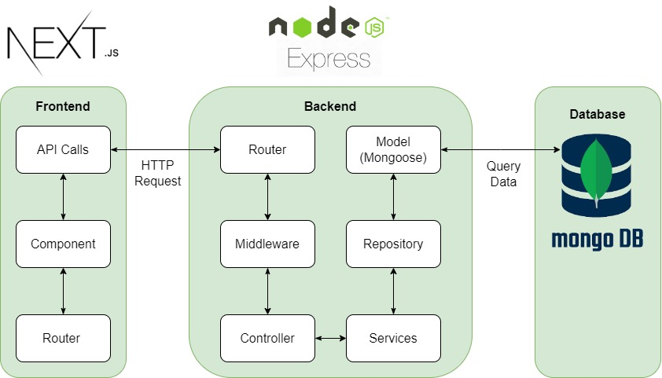

# **ShareAndCare Shop**

**ShareAndCare Shop** là dự án thương mại điện tử tập trung vào các sản phẩm thời trang bền vững và thân thiện với môi trường. Chúng tôi hướng đến việc cung cấp cho người tiêu dùng các sản phẩm thời trang chất lượng cao, góp phần giảm thiểu tác động xấu đến môi trường và xây dựng thói quen tiêu dùng bền vững.

## **Mục lục**

- [Mục tiêu dự án](#1-mục-tiêu-dự-án)
- [Các tính năng chính](#2-các-tính-năng-chính)
- [Kiến trúc hệ thống](#3-kiến-trúc-hệ-thống)
- [Hướng dẫn cài đặt và chạy dự án](#4-hướng-dẫn-cài-đặt-và-chạy-dự-án)

## **1. Mục tiêu dự án**

- **Xây dựng nền tảng thương mại điện tử** chuyên bán các sản phẩm thời trang bền vững.
- **Tạo ra trải nghiệm mua sắm thân thiện và trực quan** cho người tiêu dùng.
- **Nâng cao nhận thức** của cộng đồng về tiêu dùng xanh và thời trang bền vững.

## **2. Các tính năng chính**

## **3. Kiến trúc hệ thống**

## **4. Hướng dẫn cài đặt và chạy dự án**
